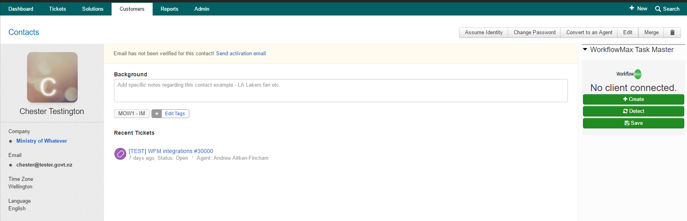
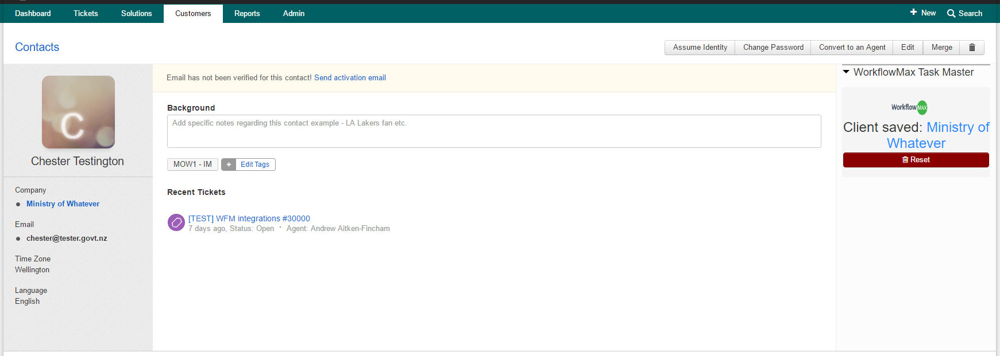
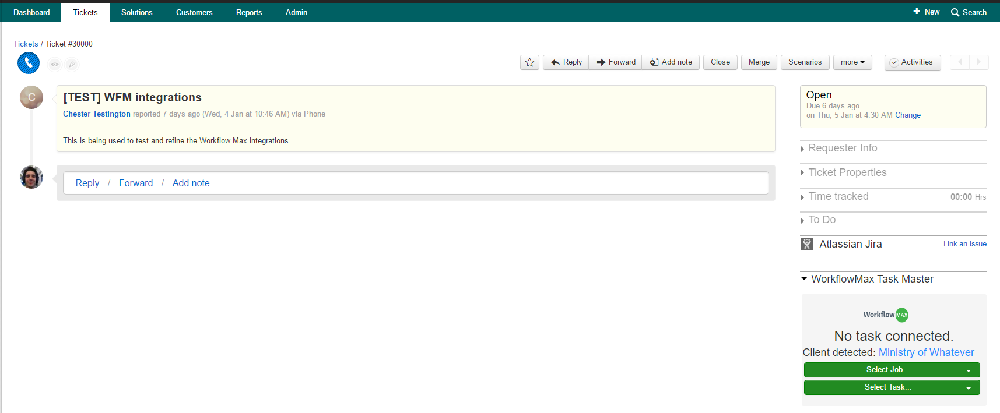
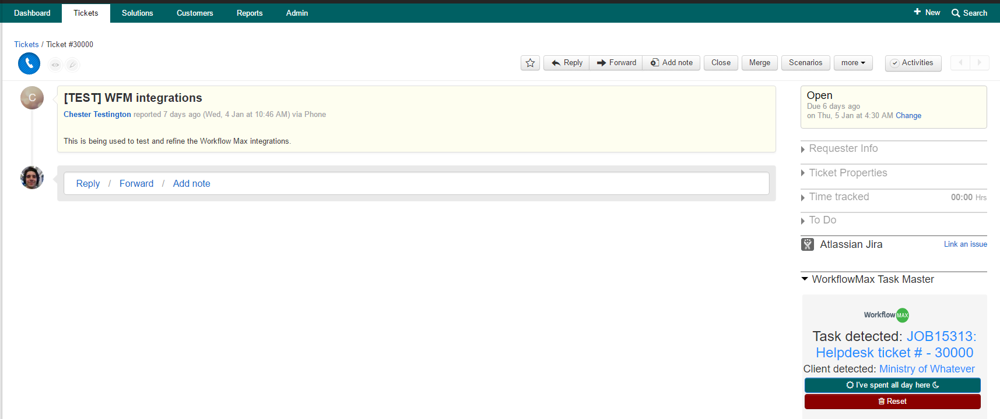

## WorkflowMax Task Master for Freshdesk

This app will add a few helper widgets for Workflow Max integration.

Please note that **logging time should still be done via the official App**. This will only help you manage tasks and clients (and log a full day if you've had a rough one).

--------------------------------------------------------------------------------------

Contact Screen
==============

- **Create** will add a new Client in Workflow Max for the Company that this Contact is from. It will set the Contact as the primary contact in Workflow Max. This is only a skeleton, designed to be properly filled in once you have time. Once created, the connection will be saved to the database.

- **Detect** will perform a basic search through the existing Workflow Max clients and return the one that matches the Company name the closest. If it is correct, you can save it to the database.

- **Save** will confirm the detected client as a link to this Company.

- **Reset** will delete the connection information stored in the database, allowing you to detect/create again.

#### TODOs

- allow a client to be manually entered rather than searching and hoping
- once Freshdesk implements [this feature request](https://support.freshdesk.com/support/discussions/topics/313250) move this app to the Company page

--------------------------------------------------------------------------------------

Ticket Screen
=============

- **Client** is picked up based in the ticket requester

- **Select Job** dropdown is populated based on the Jobs associated with the detected client.

- **Select Task** dropdown is populated based in the Job picked above. There will also be a **Create** button once the Job has been selected.

- **Create** will add a new Task under the Job selected in the dropdown called "Helpdesk ticket # - {number_of_ticket}"

- **I've spent all day here** is a simple helper button that will log 8 hours for you against this ticket for the day.

- **Reset** will delete the task information stored in the database for this ticket, allowing you to pick another one to associate.

#### TODOs

- sync it up with the timetracker to bring it in automatically, rather than still have to pick it out.
- styling, oh wow the styling
- code cleanup
- allow different types of tasks to be generated